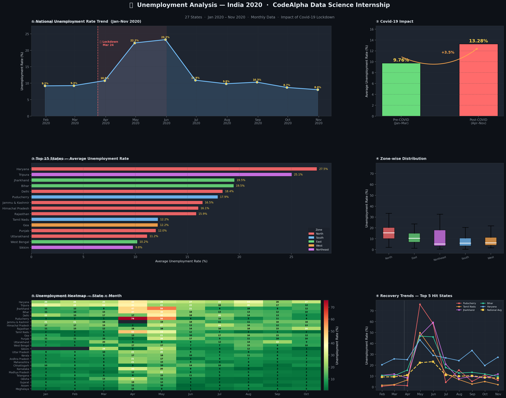

# 📉 Unemployment Analysis with Python — CodeAlpha Internship Task 2



## 📌 Project Overview
This project analyzes **India's unemployment rate data** from January to November 2020,
investigating the devastating impact of **Covid-19 lockdown** on employment across 27 states.
Built as part of the **CodeAlpha Data Science Internship (Task 2)**.

---

## 📁 Project Files

| File | Description |
|------|-------------|
| `unemployment_analysis.py` | Main Python script — full EDA, analysis & dashboard |
| `unemployment_dashboard.png` | 6-panel static visualisation dashboard |
| `index.html` | Interactive dashboard with charts |
| `Unemployment_Rate_upto_11_2020.csv` | Dataset — 267 records, 27 states |
| `README.md` | Project documentation |

---

## 📂 Dataset

| Property | Detail |
|----------|--------|
| Source | CodeAlpha / Kaggle (CMIE) |
| Records | 267 rows |
| States | 27 Indian States |
| Date Range | January 2020 – November 2020 |
| Frequency | Monthly |
| Features | State, Date, Unemployment Rate (%), Employed, Labour Participation Rate, Zone, Lat/Long |

---

## ⚙️ Tech Stack

| Tool | Purpose |
|------|---------|
| Python 3 | Core language |
| Pandas | Data cleaning & manipulation |
| NumPy | Numerical operations |
| Matplotlib | Static visualisations |
| Seaborn | Statistical plots |

---

## 📊 Dashboard Panels

| Panel | Content |
|-------|---------|
| ① | National Unemployment Trend (Jan–Nov 2020) |
| ② | Pre vs Post Covid-19 Comparison |
| ③ | Top 15 States — Average Unemployment Rate |
| ④ | Zone-wise Distribution (Box Plot) |
| ⑤ | State × Month Heatmap |
| ⑥ | Recovery Trends — Top 5 Worst-Hit States |

---

## 🔑 Key Findings

| Insight | Value |
|---------|-------|
| Pre-COVID avg unemployment | 9.76% |
| Post-COVID avg unemployment | 13.28% |
| Relative increase | +36.1% |
| Peak month | May 2020 (23.24%) |
| Worst hit state | Puducherry (75.85% in April 2020) |
| Most resilient zone | West India (8.24% avg) |
| Hardest hit zone | North India (15.89% avg) |

---

## 🦠 Covid-19 Impact Analysis

```
Jan 2020 → 7.34%   (Pre-lockdown — normal)
Feb 2020 → 7.18%   (Pre-lockdown — normal)
Mar 2020 → 8.75%   (Lockdown announced Mar 24)
Apr 2020 → 21.03%  ⚠️  Lockdown impact begins
May 2020 → 23.24%  🔴  PEAK — worst month
Jun 2020 → 10.97%  🔄  Unlock 1.0 begins
Jul 2020 → 7.43%   📈  Recovery accelerating
Aug 2020 → 8.35%   📈  Continuing recovery
Sep 2020 → 6.67%   ✅  Near pre-COVID levels
Oct 2020 → 6.97%   ✅  Stabilising
```

---

## 🚀 How to Run

```bash
# 1. Clone the repository
git clone https://github.com/divyalatha974/CodeAlpha_UnemploymentAnalysis

# 2. Go into the folder
cd CodeAlpha_UnemploymentAnalysis

# 3. Install dependencies
pip install pandas matplotlib seaborn numpy

# 4. Run the analysis
python unemployment_analysis.py
```

---

## 🌐 Interactive Dashboard
👉 [Open Interactive Dashboard](https://divyalatha974-sudo.github.io/CodeAlpha_UnemploymentAnalysisWithpython/index.html)


---

## 📌 Policy Recommendations

- 🏗️ **North & East India** — Expand MGNREGA and rural employment schemes
- 🏙️ **Urban areas** — Gig economy regulation and social protection floors
- 🌴 **Puducherry & Tamil Nadu** — Tourism sector revival packages
- 🏭 **Manufacturing states** — SME support and credit accessibility
- 📊 **All states** — Real-time employment monitoring dashboards

---

## 🎓 Internship Details

- **Company** : CodeAlpha
- **Domain**  : Data Science
- **Task**    : Task 2 — Unemployment Analysis with Python

---

⭐ If you found this helpful, please **star** the repository!
